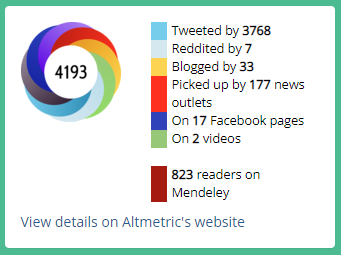

# Altmetric #

## Summary ##


Display altmetric badges for items with appropriate identifiers.

Configuration options are detailed in the z_altmetric.pl file.

Please see https://www.altmetric.com/solutions/free-tools/institutional-repository-badges/

### November 2025 - v2.0.0 release ###
The Altmetric API now _requires_ an API key. If an API key is not defined the plugin will
now fall-back to the 'embed' method of adding a badge. This provides much of the same funcionality, although 
does not support internationalisation that v2.0.0+ of this extension does.

If no API key is configured the badges displayed will use the attributes defined in the `cfg.d/z_altmetric.pl` file.
By default these are:

```perl
$c->{altmetric}->{badge_attributes} = {
        'data-badge-type'    => 'donut',
        'data-badge-details' => 'right',
        'data-condensed'     => 'true',
};
```

Refer to https://badge-docs.altmetric.com/badge-playground.html for more details on the available options.

### Upgrading to v2.0.0 ###
This version is available as both [an ingredient](https://github.com/eprintsug/altmetric/tree/3_4) and an EPM in the Bazaar.

- If you have customised versions of the css or javascript files, please review these. If custom css was added to support other
  languages, please define this text in an appropriate language phrase file based on `en/altmetric.xml`
- If badges are not displaying on summary pages you may need to refresh the astracts, either by running `bin/generate_abstracts` or
  via the 'Regenerate abstracts' button on the Admin screen

If you have issues, please ask on the EPrints tech list.

## Displaying the badge ##
By default this plugin configures a 'Box' to be displayed on an item's summary page. The location and order of this box can be controlled
with the 'appears'  parameter for the plugin:
`$c->{plugins}->{"Screen::EPrint::Box::Altmetric"}->{appears}->{summary_bottom} = 25;`

If your repository doesn't use boxes to display content on summary pages there are also EPScript functions to use:
- `$item.altmetric_badge(1)` - the '1' parameter tests to see if an appropriate identifier is present in the record and a badge could be displayed
- `$item.altmetric_badge()` - renders the badge - either using the API or embed method
- `$item.altmetric_embed_script()` - inserts the embed javascript. This should only be included once on a page, and is not necessary if you are using
the API-based badge display.

Combining the above, an example that could be used on a summary page is:
```xml
<epc:if test="$item.altmetric_badge(1)">
    <h2>Altmetric</h2>
    <div id="summary_altmetric" class="panel panel-body">
        <epc:print expr="$item.altmetric_embed_script()" />
        <epc:print expr="$item.altmetric_badge()" />
    </div>
</epc:if>
```

The EPScript methods could also be used on e.g. view or search-result citations, but `$item.altmetric_embed_script()` should be omitted in the item citation
and included on the page in a phrase or template using:
```xml
<epc:print expr="altmetric_embed_script()"/>
```

## Colour palette ##
The colours used on the Altmretic convey which sources contribute to the overall score.
The colours used in the CSS are based on the following records which cover all current sources:
- Most sources: https://www.altmetric.com/details/43673388
- Clinical guideline: https://www.altmetric.com/details/40679400
- Q&A: https://www.altmetric.com/details/1558157
- Bluesky: https://www.altmetric.com/details/32695585

## Useful DOIs for testing ##

- 10.1038/s41586-018-0179-y
- 10.1038/nature.2014.14583

## Version history ##

### Version 2.0.0 ###
- Updates to spport API key being mandatory. Falls back to embed if key isn't defined.
- Updates description of some sources (twitter -> X) and adds new sources (Bluesky)
- Improve accessibility by removing CSS before/after text
- Renders details panel on server, allowing phrases to be used for better internationalisation
- Uses `JSON` module to output content
- Uses `EPrints::DOI` module if available when getting DOI from eprint
- Aligned colours with Altmetric site
- Added EPScript methods to embed badges without use the 'Box'.

See https://details-page-api-docs.altmetric.com/data-endpoints-counts.html#response-object and
 https://help.altmetric.com/support/solutions/folders/6000237990 for details of 'cited by' data.


### Version 1.3.0 (not released as an EPM) ###
- Adds user-agent in request made to Altmetric API
- Displays default phrase (supports multiple languages) with link to Altmetric site before badge is displayed. See the [altmetric.xml phrase file](lib/lang/en/phrases/altmetric.xml#L9).
- Above phrase is also used when the badge is displayed 
- If there is no Altmetric-supported identifier in the record, the EPrints Box is not rendered

If you add internationalised phrases to your repository and they don't appear to work, make sure the 'auto' javascript file has been reloaded.

### Version 1.2.0 ###
Adds the repository domain to the link back to Altmetric. This can enable more data to be shown.
See note in z_altmetric.pl for details on how to register your repository domain.

### Version 1.1.0 ###
Adds ability to use other IDs supported by Altmetric API e.g. ISBN.
The data used from the EPrint is now a config option so repositories can tailor this to suit the data they hold. See cfg.d/z_altmetric.pl.

The attributes used for the rendering have changed to:

* `data-altmetric-id`
* `data-altmetric-id-type`

If you are integrating the Altmetrics using something other than the `EPrints::Plugin::Screen::EPrint::Box::Altmetric` class, 
you will need to change how you render the attributes yourself!

## Displaying Altmetric data without using this plugin ##

The Altmetric team also provide a wrapper script that can be used to add Altmetric badges to your pages. Details are provided
on their support site: https://help.altmetric.com/support/solutions/articles/6000241753-adding-badges-in-eprints
